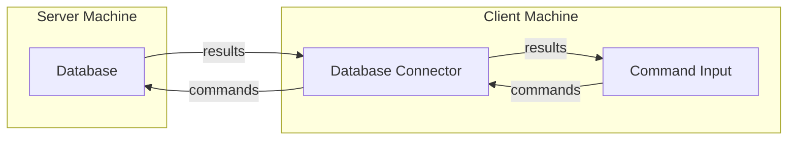
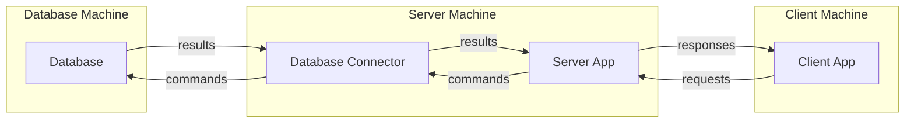

# Database knowledge

A database is a collection of data containing information of an enterprise.

## Database management systems (DBMSs)

A database management system is databases and software to manipulate them in an efficient and convenient way.

## File processing systems

In a file processing system (FPS), data are stored in files in various formats and the ways to manipulate them.

### Disadvantages of FPSs

- [Data redundancy](#data-redundancy) and [inconsistency](#data-inconsistency)
- [Data retrieving difficulty](#data-retrieving-difficulty).
- Data isolation.
- Integrity problems.
- [Atomicity problems](#data-atomicity-problems).
- [Concurrency anomalies](#concurrency-anomalies).
- [Security problems](#security-problems).

#### Data redundancy

The same information is stored in many places.

#### Data inconsistency

Due to [data redundancy](#data-redundancy), missing changes in one or more places leads data inconsistency.

#### Data retrieving difficulty

Retrieving expected data in a big file is not an easy task. So it's easy to understand the difficulty of
retrieving expected data spreading in multiple files and the cost to implement them each time.

#### Data atomicity problems

Data atomicity is when many changes are considered as one change, they must be all successful or nothing done.

Due to [data redundancy](#data-redundancy) and the possibility of [data inconsistency](#data-inconsistency), data
atomicity can't be guaranteed.

#### Concurrency anomalies

To achieve better performance, the same data may be changed simultaneously by more than one user with locking
mechanisms. These locking mechanisms are difficult and error-prone to implement due
to [data redundancy](#data-redundancy).

#### Security problems

In a file system, we can't apply permission limit on a portion of a file.

## Data abstraction in DBMS

Users can manipulate data without knowing how data is stored or maintained.

### Data transaction levels

- Physical: the lower abstraction level describing the physical structures to store data.
- Logical: the middle abstraction level describing data logical structures and relationships between them.
- View: the highest abstraction level describing different portions of data.

## Database instances

A database instance is the database itself of a particular version based on using purpose, for example, multiple
environments such as development, testing, and production.

## Database schemas

A database schema is the design of a particular component of a database. These designs are categorised
according to the [data abstraction levels](#data-transaction-levels).

## Data models

A data model is how we identify a data to a specific group, the semantics and constraints of each group, and the
relationship between these groups.

See [Data models](data-model/README.md).

## Database languages

Database language is a language used to interact with databases that often split
into [DDL](#ddl-data-definition-language) and [DML](#dml-data-manipulation-language) sub-languages.

### DDL (Data Definition Language)

DDL is used to work with [database schemas](#database-schemas) and constraints.

### DML (Data Manipulation Language)

DML is used to manipulate data including retrieving, insertion, updating, and deletion. There are two common types of
DML are [Procedural DML](#procedural-dml) and [Declarative DML](#declarative-dml).

#### Procedural DML

Procedural DML is a DML that requires to specify what data are needed and how to get them also.

#### Declarative DML

Declarative DML, also non-procedural DML, is a DML that requires to specify what data are needed without specifying how
to get them.

#### Query language

In DML, there is a sub type of language to retrieve data, the query language.

## Database user groups

There are two typical database user groups:

- [User](#database-users-in-user-group)
- [Administrator](#database-administrators-dba)

### Database users in user group

- Naive users: who interact with databases through application interfaces only.
- Application programmers: who write applications.
- Sophisticated users: who interact with databases through query processor mostly for analysing and reporting purposes.

### Database administrators (DBA)

A DBA of an [DBMS](#database-management-systems-dbmss), is the person who central control
the [DBMS](#database-management-systems-dbmss), including:

- Schema definition
- Storage structure and access-method definition
- Schema and physical-organization modification
- Granting permissions for [users in user group](#database-users-in-user-group)
- Routine maintenance
    - Backup
    - Adjust free disk space
    - Performance monitoring

## Database transaction

Database transaction is a single logical unit of work of one or more database operations. Its characteristic includes:

- Atomicity: all-or-none
- Consistency: the correctness of data after the transaction was committed or rollback.
- Durability: once a transaction was successful, its result must be persistent regardless system failures.

Transactions are managed by the transaction management module with the helps of failure recovery and
concurrency-control manager.

## DBMS modules

Generally, a [DBMS](#database-management-systems-dbmss) includes two modules:

- [Storage manager](#storage-manager)
- [Query processor](#query-processor)

### Storage manager

The storage manager is responsible for storing, retrieving, and update data. Its components often includes:

- Authorization and integrity manager: keeps the integrity constraints and checks the user authorization on a particular
  action.
- Transaction manager: ensures the data consistency.
- File manager: manage disk space and data structures stored the information.
- Buffer manager: decides and fetches data from disk to memory.

Main data structures the storage manager works with:

- Data files
- Data dictionary: stores database metadata, e.g., schemas.
- Indices: provides fast access.

### Query processor

The query processor interprets, compiles, and executes the queries.

Its main components:

- [DDL](#ddl-data-definition-language) interpreter: interprets [DDL](#ddl-data-definition-language) statement to
- [DML](#dml-data-manipulation-language) compiler: translates [DML](#dml-data-manipulation-language) statements to
  evaluation plans consisting low-level instructions and chooses the lowest
  cost plan (query optimization).
- Query evaluation engine: execute the low-level instructions.

## Database application architectures

Generally, a database application is a network application has three main components:

- A command input: an application for user to input [database language](#database-languages) commands directly
  or indirectly (the application generates the database commands based on the provided features).
- A database connector: the implementation of a particular database connectivity standard (i.e., APIs - Application
  Programming Interfaces) for the
  command input to connect and interact
  with the
  database. ODBC (Open Database Connectivity) and JDBC (Java Database Connectivity) are two popular database
  connectivity standards.
- And the database.

Because they
are [network applications](https://github.com/nghianguyentek/software-architecture/blob/main/network.md#network-application)
, there are two architectures are often used, [2-tier](#2-tier-database-applications)
and [3-tier](#3-tier-database-applications)(https://github.com/nghianguyentek/software-architecture/blob/main/3-tier.md)
.

### 2-tier database applications

Based on the [2-tier network architecture](https://github.com/nghianguyentek/software-architecture/blob/main/2-tier.md),
the components can be arranged as the below figure:

**Figure 1:** *2-tier database application architecture.*

The typical 2-tier database applications are Query and BI (Business Intelligent) tools for database management,
data analytic, and
report generations.

### 3-tier database applications

A 3-tier database application is just an extension of a [2-tier](#2-tier-database-applications) one. It separates
the
command input component to:

- Client App component: is mainly responsible for rendering UI, receiving and validating user input, and then, sending
  user input
  to the Server App.
- Server App component: is responsible for validating user input receiving from the Client App, executing the
  appropriate business
  logic, and translating them into database commands when necessary. These commands will be sent to the Database
  Connector as in the [2-tier database architecture](#2-tier-database-applications).

And arranging them as the below figure:

**Figure 2:** *3-tier database application architecture.*

Most common enterprise applications are 3-tier database application, especially web and mobile applications.

### n-tier database applications

A n-tier database application, as you can guess, is an extension of a [3-tier](#3-tier-database-applications) one. Based
on the actual needs, we separate the Server App component to two or more sub-tiers.
