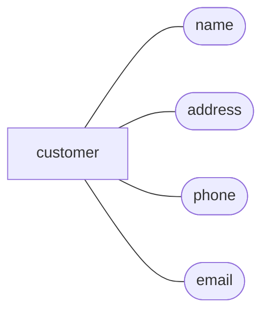
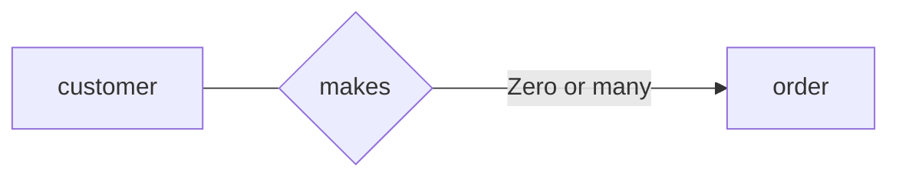

# Entity-Relationship (E/R) model

E/R model is a logical model to represent data in a database. It's the presentation of a [logical database schema](../README.md#database-schemas) and often used in high level database design step.

In E/R model, data is represented in [entities](#entities) and their [relationships](#entity-relationships).

## Entities

A distinguishable real world thing (both logical or physical) that has a set of attributes.

For example, an customer
entity with name, address, phone, and email attributes.

## Entity sets

An entity set is entities having the same type.

## Entity relationships

The relationship between two [entity sets](#entity-sets).

For example, a customer can make some orders.

## E/R diagram

A diagram represents [logical database schemas](../README.md#database-schemas) in E/R model.

### E/R diagram symbols

- Rectangle: an [entity set](#entity-sets).
- Ellipse: an attribute of an [entity](#entities).
- Diamond: a relationship of two entity sets.
- Line: link an entity (rectangle) and its attributes (ellipses) and its relationships (diamonds).

For example, an E/R diagram of customer and order entities.

