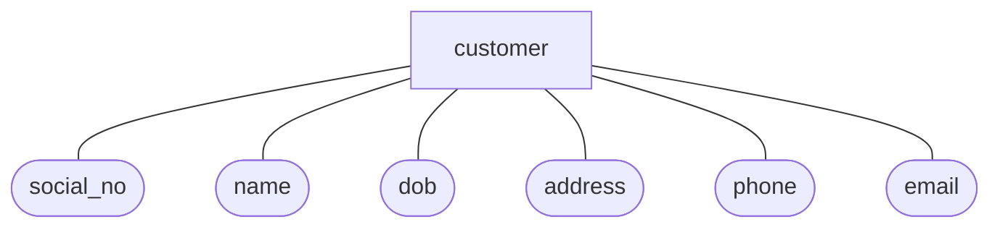

# Entity-Relationship (E/R) model

E/R model is an overall logical model to represent data in a database. It's the presentation of
a [logical database schema](../README.md#database-schemas) and used in conceptual design high level database design step.

In E/R model, data is represented in [entity sets](#entity-set) and their [relationships](#entity-relationships).

## Entity

An entity is a distinguishable real world thing (both logical or physical) that has specific information about it.

For example, a customer A (the entity) has the following information:

- a social number: 123456789
- a name: A
- a day of birth: 1993/11/12
- an address: 123 St
- a mobile phone number: 0901234567
- and an email address: a@mail.com.

## Entity attribute

An entity attribute is a characteristic or a trait of the entity.

In the upper customer A entity example, social number, name, day of birth, address, phone, and email address are
attributes of our customer entity type.

## Attribute set

The set of all attributes of an entity type are called its attribute set.

## Entity set

An entity set is [entities](#Entity) having the same type (i.e., the same [attribute set](#attribute-set)).

Continuing with our customer entity, it's easy to recognize the customer entity set has an attribute set include a social number, a name, a day of birth, an address, a mobile phone number, and an email address.

## Entity relationships

The relationship between two [entity sets](#entity-set).

For example, a customer can make some orders.

## Relationship set

A relationship set of entity sets is a group of similar relationships of those entity sets.

We can represent the relationship set of `customer` and `order` entity sets, the `customer_order` relationship set, containing customer identifier and order identifier as in the below figure:

## E/R diagram

A diagram represents [logical database schemas](../README.md#database-schemas) in E/R model.

### E/R diagram symbols

- Rectangle: an [entity set](#entity-set) or an [relationship set](#relationship-set).
- Ellipse: an attribute of an [entity set](#entity-set).
- Diamond: a relationship of two [entity sets](#entity-set).
- Line: link an entity (rectangle) and its attributes (ellipses) and its relationships (diamonds).

For example, an E/R diagram of customer and order entities.

