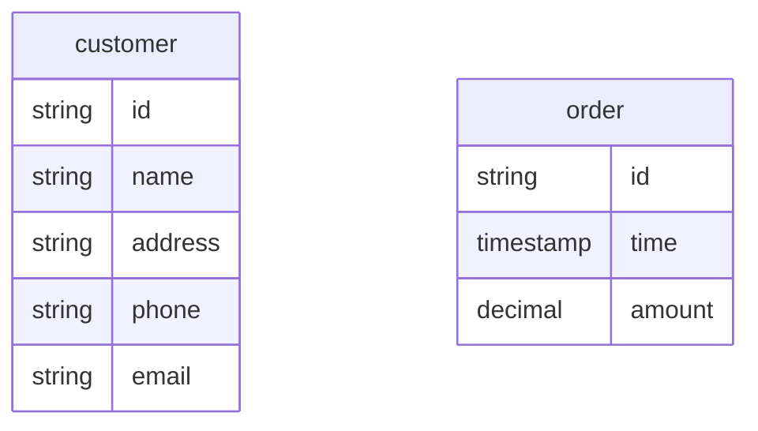
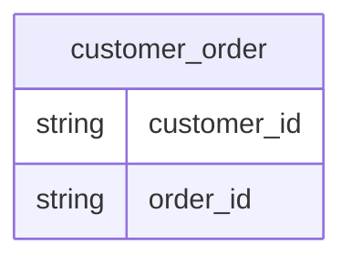

# Relational model

A relational model is the physical presentation of an [E/R model](er.md). It's often used in the detail database design
step.

In relation model, [entity set](er.md#entity-sets) is represented by a [data table (tuple)](#data-table) with columns
and
rows. The [entity relationships](er.md#entity-relationships) can be represented explicitly
by [relationship table](#relationship-tables) or implicitly by data
constraints.

## Data table

A data table in relational model is an [entity set](er.md#entity-sets) where each column is an entity attribute and each
row (record) is an particular entity.

For example, physical schemas of customer and order entity sets.

## Relationship tables

A relationship table is a [data table](#data-table) contains the relationship of two or more [data tables](#data-table)
and thus, represents the corresponding entity relationships.

For example, customer_order relationship table.

